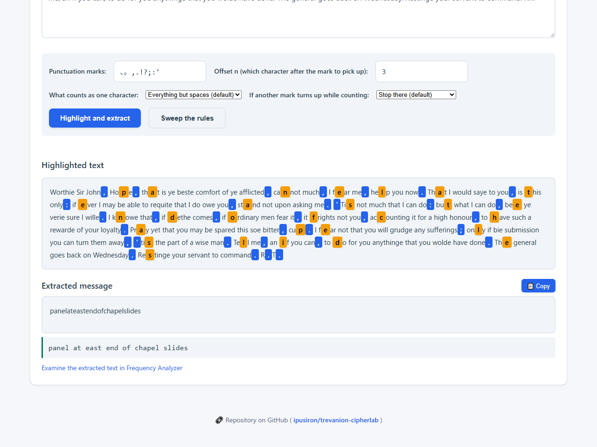
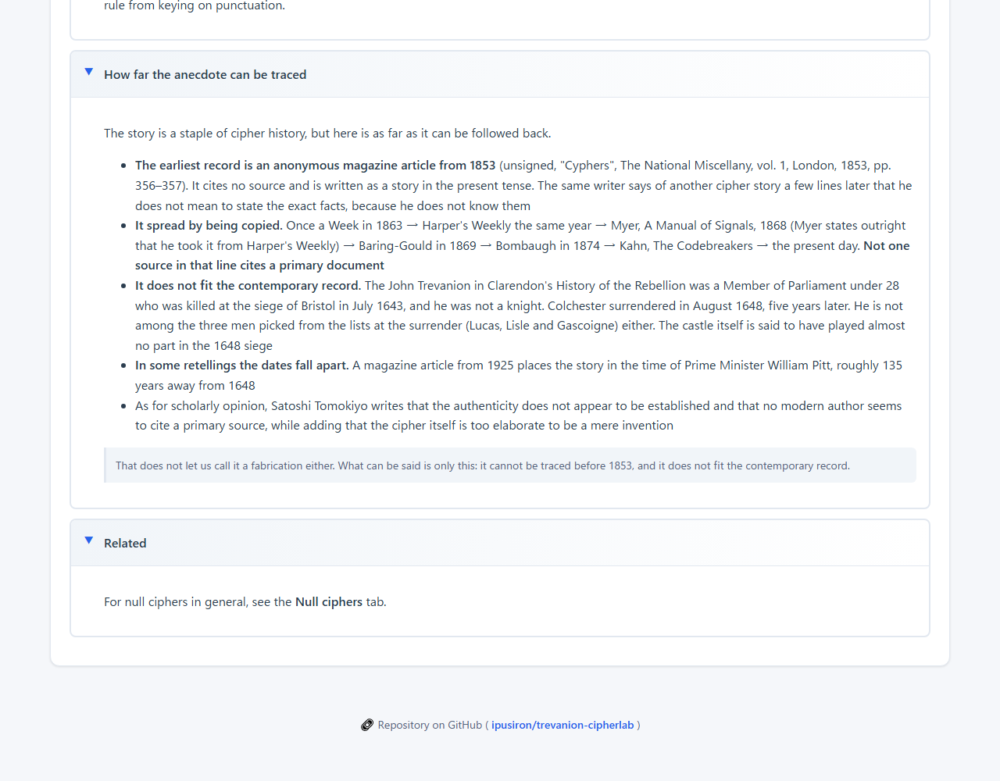
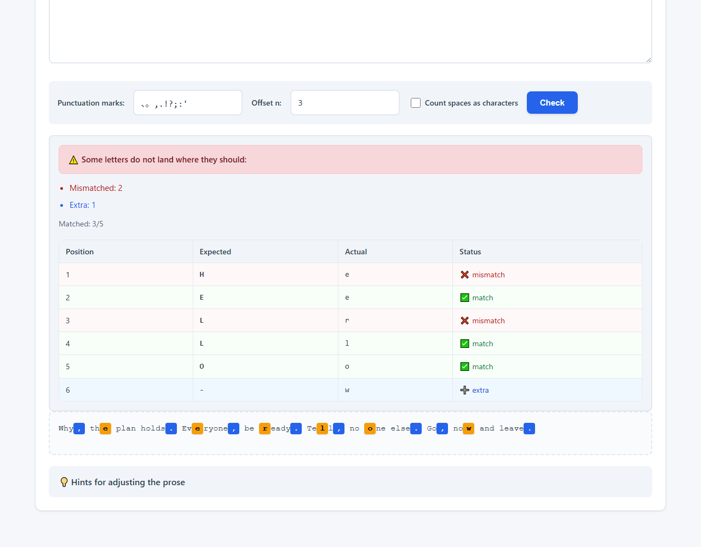
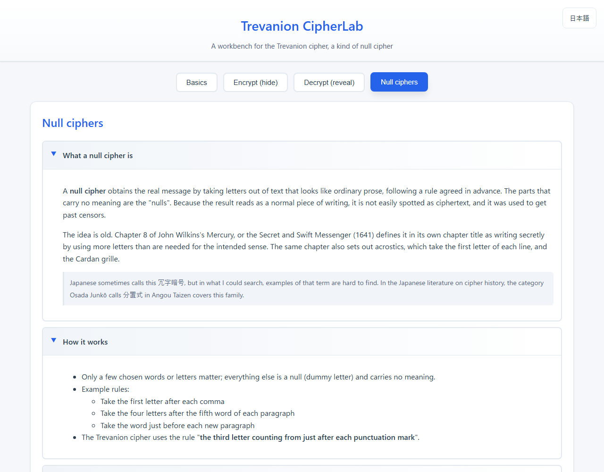
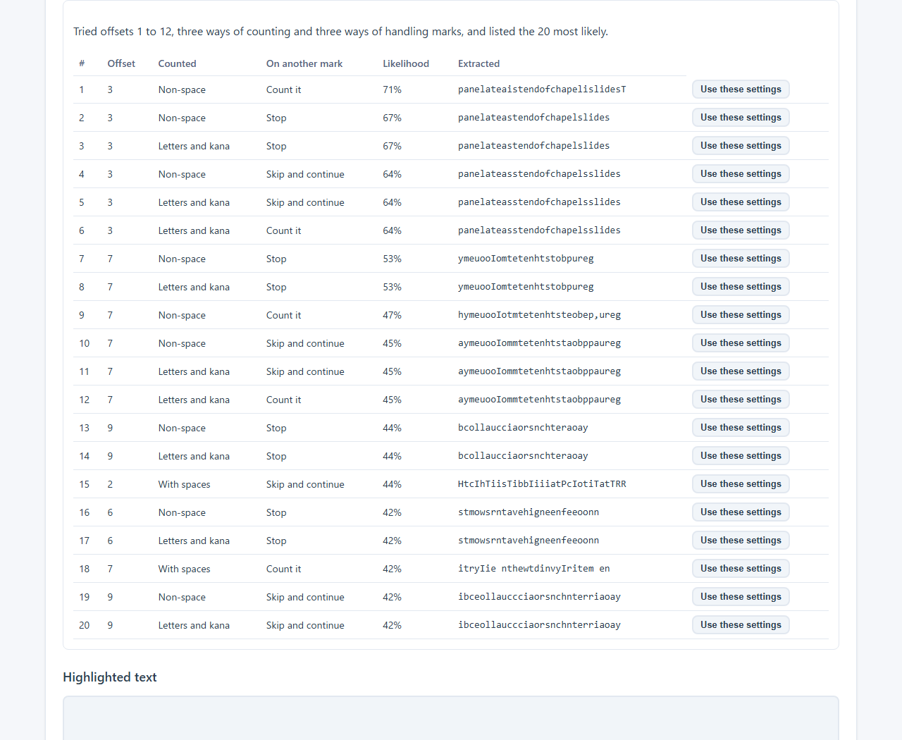

English · [日本語](README.md)

# Trevanion CipherLab - a workbench for the Trevanion cipher


[](https://ipusiron.github.io/trevanion-cipherlab/)

**Day069 - 100 Security Tools with Generative AI**

**Trevanion CipherLab** is a web app for seeing and learning the **Trevanion cipher**.

The Trevanion cipher is a kind of **null cipher**: the message is recovered by picking up **the third letter counting from just after each punctuation mark** (the marks are 、 and 。 in Japanese, and , . ; : ' in English).

**What is implemented**: decryption (with the text highlighted), and help for writing a covertext (the constraint check).

**What is experimental**: generation and the search for exact matches. The way it is built now, the word placed right after a punctuation mark is the connective, so the intended letter landing in the extraction position is left to chance. Writing the covertext yourself on the "Check a draft" screen and running the constraint check is the reliable route.

---

## 🌐 Demo

👉 **[https://ipusiron.github.io/trevanion-cipherlab/](https://ipusiron.github.io/trevanion-cipherlab/)**

Runs entirely in your browser.

---

## 📸 Screenshots

>
>*Decrypt tab, extracting the hidden sentence from the letter (blue = punctuation, yellow = the letters picked up)*

>
>*Basics tab, showing where the anecdote comes from and where it conflicts with the contemporary record, with sources*

>
>*Encrypt tab (check a draft), matching a covertext you wrote yourself letter by letter*

>
>*Null ciphers tab, defining the null cipher and giving documented uses with sources*

>
>*Decrypt tab, sweeping the rules and ranking them by how much the result looks like English or Japanese*

---

## 📑 The tabs
- **Basics**
  Background and overview of the Trevanion cipher, in accordions. For null ciphers in general, see the "Null ciphers" tab.
- **Encrypt**
  - **Check a draft**: enter a plaintext, draft a covertext, and the constraint check shows which letter each punctuation mark has to be followed by. Matches and mismatches are colour coded, so it is clear what to fix.
  - **Generate**: builds a covertext from the plaintext. English and Japanese, several candidates, and a search for exact matches. A quality filter and a progress display keep it safe to run.
  See the [guide to the encryption screens](ENCRYPTION.md) for details.
- **Decrypt (reveal)**
  Picks up **the character n positions after each punctuation mark** from the input and shows it **highlighted** in place. A vertical layout keeps it readable, and the result can be copied.
  - **Choose how to count**: what counts as one character (everything but spaces / spaces too / letters, digits and kana only) and what to do when another mark turns up while counting (stop there / skip it and keep counting / count it as a character)
  - **Sweep the rules**: tries offsets 1 to 12 × three ways of counting × three ways of handling marks and ranks them by **how much the result looks like English or Japanese**. "Use these settings" on any row brings that rule straight onto the screen.
  - **Word spacing**: the extracted string has no spaces, so a small English dictionary splits it back into words (`panelateastendofchapelslides` → `panel at east end of chapel slides`). If a word is not in the dictionary the split fails, and nothing is shown.
  - **Hand it to another tool**: a link opens the extracted text in [Frequency Analyzer](https://ipusiron.github.io/frequency-analyzer/) (Day009). It travels in the URL fragment, so nothing is sent to a server.
- **Null ciphers**
  Definition and characteristics of the null cipher, how it relates to steganography and to concealment ciphers (in accordions), and a link to Day036 "Hidden Message Challenge".

### The marks and the rule as assumed here
- The set of punctuation marks (you can change it)
  - Initial setting: `、。,.!?;:'` (Japanese and English together)
  - Free to edit
- The rule: take **the third character counting from just after each mark**
- Offset: positions other than the third can be set (1 to 12)
- What to count: everything but spaces (default) / spaces too / letters, digits and kana only
- When another mark turns up while counting: stop there (default) / skip it and keep counting / count it as a character

---

## 🔒 Null ciphers

### Definition

A **null cipher** obtains the real message by taking characters out of text that reads as ordinary prose, following a rule agreed in advance.
Japanese sometimes calls this 冗字暗号, but in what I could search, examples of that term are hard to find. In the Japanese literature on cipher history, the category Osada Junkō calls 分置式 (concealment) in *Angou Taizen* covers this family.

Because it reads as a normal piece of writing, it is not easily spotted as ciphertext, and it was used to get past censors.

### How it works
- Only a few chosen words or characters matter; everything else is a "null" (dummy letter) and carries no meaning.
- The rules vary. For example:
  - take the first letter after each comma
  - take the four letters after the fifth word of each paragraph
  - take the word just before each new paragraph
- The Trevanion cipher used the rule "**take the third letter counting from just after each punctuation mark**".

### Background and uses
- Long used in the secret letters of spies and prisoners, to deceive censors.
- Today it is treated as the ancestor of hidden messages and steganography, and taken up in teaching and in historical work.

### Characteristics
- Nothing is transposed or substituted; the characters sit in the text as they are.
- Because it blends into natural prose, it has the character of **steganography**.
  - Using nulls heavily to conceal is not practical: the writing turns stilted, draws suspicion, and may be singled out for analysis.
- It carries little information and is inefficient, but it hides the fact that a cipher is in use at all.

### Kinds of null cipher

- Chronograms
- Acrostics
- Reading the nth character after each punctuation mark, for example the Trevanion cipher and the cipher in Conan Doyle's "The Gloria Scott"

### Making one by hand (an example)
1. Fold a sheet of paper lengthwise in three.
2. Write the message down the fold.
3. Open the fold and fill either side with nulls until it reads as natural prose.
→ The recipient recovers the plaintext by reading down the fold.

### Hints for spotting one
- The wording is oddly wordy or stiff.
- Meaningful strings appear at a fixed interval or in fixed positions.
→ Text with those traits may be a null cipher.

---

## 🗝️ The Trevanion cipher

Marks (commas and full stops, plus colons, apostrophes and the like) act as the signal to start counting, and taking the third character from each mark gives the plaintext.

Where fewer than three letters stand between two marks, that mark is skipped.

The resulting string carries neither spaces nor punctuation, so it has to be adjusted by hand to read as English.

## 📚 Historical background

The cipher comes with the following story. **No primary source for it can be found, however** (see "How far the anecdote can be traced" below).

During the **English Civil War**, the Royalist **Sir John Trevanion** was captured and imprisoned in **Colchester Castle**, north-east of London. While he awaited judgement, a letter in English signed **R.T.** arrived. It is pious and unremarkable, and reads as follows.

> *Worthie Sir John, Hope, that is ye beste comfort of ye afflicted, cannot much, I fear me, help you now. That I would saye to you, is this only: if ever I may be able to requite that I do owe you, stand not upon asking me. 'Tis not much that I can do: but what I can do, bee ye verie sure I wille. I knowe that, if dethe comes, if ordinary men fear it, it frights not you, accounting it for a high honour, to have such a rewarde of your loyalty. Pray yet that you may be spared this soe bitter, cup. I fear not that you will grudge any sufferings; only if bie submission you can turn them away, 'tis the part of a wise man. Tell me, an if you can, to do for you anythinge that you wolde have done. The general goes back on Wednesday. Restinge your servant to command. R.T.*

On the surface it is **an ordinary private letter** of consolation and loyalty.

In fact the letter is a **null cipher**.
Taking **the third letter counting from just after each punctuation mark**, in order, brings out the real message.

What the relevant positions in the letter spell is this.

> *panelateastendofchapelslides*

Put the spaces back between the words and it reads:

> **panel at east end of chapel slides**

The instruction says that **a panel at the east end of the chapel in the castle moves**. Trevanion asked to pray in the chapel and escaped from there — so the story ends, as it is told.

However, **the escape does not appear in the earliest record (1853)**. That article says it will leave to others the question of how he got away, and does not tell it. The escape turns up only in the line of retellings from 1863 onwards.

### How far the anecdote can be traced

- **The earliest record is an anonymous magazine article from 1853** (unsigned, "Cyphers", *The National Miscellany*, vol. 1, London, 1853, pp. 356–357). It cites no source and is written as a story in the present tense. The same writer says of another cipher story a few lines later that he does not mean to state the exact facts, because he does not know them
- **It spread by being copied.** *Once a Week* in 1863 → *Harper's Weekly* the same year → Myer, *A Manual of Signals*, 1868 (Myer states outright that he took it from *Harper's Weekly*) → Baring-Gould in 1869 → Bombaugh in 1874 → Kahn, *The Codebreakers* → the present day. **Not one source in that line cites a primary document**
- **It does not fit the contemporary record.** The John Trevanion in Clarendon's *History of the Rebellion* was a Member of Parliament under 28 who was killed at the siege of Bristol in July 1643, and he was not a knight (Clarendon gives `sir` to Slanning, named alongside him, but not to Trevanion). Colchester surrendered in August 1648, five years later. He is not among the three men picked from the lists at the surrender (Lucas, Lisle and Gascoigne) either. The castle itself is said to have played almost no part in the 1648 siege; the chapel is on the second floor of the keep, and the stair found in 1922 is three levels below it
- **In some retellings the dates fall apart.** A magazine article from 1925 places the story in the time of Prime Minister William Pitt, roughly 135 years away from 1648
- Hulme's *Cryptography* (1898), the first book-length history of ciphers in English, uses the phrase `nulles or non-significants` and yet **never mentions Trevanion or Colchester at all**
- As for scholarly opinion, Satoshi Tomokiyo writes that the authenticity does not appear to be established and that no modern author seems to cite a primary source, while adding that the cipher itself is too elaborate to be a mere invention

That does not let us call it a fabrication either. What can be said is only this: it cannot be traced before 1853, and it does not fit the contemporary record.

### About the text of the letter

At least two versions of the letter are in circulation. **Which one you use changes which settings are correct.**

| Version | What it looks like | Settings in this tool |
|---|---|---|
| With apostrophes (`'Tis`) | Mixed case. The form this tool uses as its example | Include `'` among the marks, do not count spaces, and **stop at the next mark** |
| Upper case, no apostrophes | Spelled `TIS` | Any of the ways of counting above gives the same result |

The text this tool starts with is a blend that matches none of the 1853, 1863 or 1890 sources exactly.

### Afterlife

From the nineteenth century the story became known in popular writing on ciphers and detection.
**Arthur Conan Doyle**'s "**The Gloria Scott**", given as **the first case Holmes was involved in**, also builds a story around hiding a message in natural prose by a rule. There, though, the reader takes **every third word from the start**, which is a different rule from keying on punctuation (and it cannot be said that this method spread through that story).

### Variants

The original Trevanion cipher looks at the third character, and taking the nth character instead is the natural extension.
With n = 1 the character right after the mark is read; with n = -1, the character just before it.

### Hints for spotting a Trevanion ciphertext

- Punctuation marks turn up all over the place, in ways English grammar does not call for.
- The word "'tis" keeps appearing.

---

## 🎯 Use cases

### Ways of using this tool in particular

- Confirming that the hidden message appears only to those who know the rule (steganography classes): paste the Trevanion letter and pick the third letter after each punctuation mark, and panelateastendofchapelslides appears. Add spaces and it reads "panel at east end of chapel slides". Without the rule it looks like nothing but a devout private letter and draws none of the suspicion a ciphertext would. You can confirm, on the original of the anecdote, a steganography that only someone who knows where to look can read
- Telling signal from noise across offsets (analysis and search classes): on the same letter, change the position you pick from the 2nd to the 3rd to the 4th letter and compare the English-likelihood scores, which come out as 0.3778, 0.6741 and 0.2923; only the correct 3rd letter is clearly high. The other offsets are just strings of letters with low scores. You can confirm the idea of search, picking out the one meaningful candidate from many by a score
- Confirming that changing how you count changes the letters picked (measurement and data-processing classes): with the same letter and the same 3rd position, switching to "count spaces too" shifts the letters picked to oha ehsftsue fftcoru nsenohe, and no meaningful sentence appears. It shows that the same input gives a different result from nothing but a difference in the rule of what counts as one character

### Learning about security

- See how a null cipher works, on the letter from the anecdote itself
- Feel the difference between cryptography and steganography through text that looks like nothing at all unless you know the rule
- In a CTF or a puzzle, when a hidden message is not made of numbers, try changing the marks and the offset

### Teaching and self-study

- Set an exercise in a language class to plant a rule in a piece of writing. Writing one yourself shows how hard it is to keep the prose natural
- In a history class, use **the checking of this anecdote itself** as material for source criticism. That it cannot be traced before 1853, and that it does not fit the contemporary record, can be followed back through the sources
- In an information class, cover the ways of hiding information (cryptography and steganography) with a concrete example

### Work

- In training on leaks and censorship, show how information is mixed into ordinary prose
- Check the output of an extraction routine you wrote yourself against this tool
- When another tool disagrees, narrow it down to how it counts (whether it stops at the next mark) or how it treats spaces

### Hobby and fiction

- Build a puzzle for an escape room and check the answer
- Work out a cipher for a novel or a game in a form that actually runs
- Plant a short message in a letter or a card

### With other tools

- [Hidden Message Challenge](https://ipusiron.github.io/hidden-message-challenge/) (Day036): try concealment ciphers; its position-extraction challenge is a null cipher

### Limits

- This is a tool for learning. **It cannot keep a secret.** Anyone who knows the rule can read it, and writing to the rule tends to make the prose unnatural, which draws the eye instead
- Generation is **experimental**. For a reliable result, write the covertext yourself on "Check a draft" and run the constraint check
- The anecdote itself has not been verified (see "How far the anecdote can be traced")

---

## 🧪 Tests

```bash
npm test
```

- Runs on Node.js 22 or later. There are no dependencies (only `node --test` is used)
- GitHub Actions runs them on every push and pull request
- For both versions of the letter, which settings bring out the hidden sentence is pinned down. The tests also cover the three ways of counting, the constraint check, the edges (empty input, marks only, surrogate pairs), the contrast ratios of the palette, and static checks on index.html

---

## 📁 Directory structure

```
trevanion-cipherlab/
├── index.html              # the screen (four tabs and accordions)
├── script.js               # the screen side (reading input, display, tabs, generation)
├── style.css               # colours and layout (including narrow screens)
├── js/                     # scripts
│   ├── messages.js         # the wording on screen (one dictionary per language, same keys)
│   ├── i18n.js             # choosing the language and swapping elements marked data-i18n
│   ├── trevanion-core.js   # the calculation layer (extraction, check, sweep, word spacing; no DOM)
│   └── trevanion-words.js  # the small English dictionary used for word spacing
├── test/                   # tests (run with node --test)
│   ├── load.js             # loads the same scripts the screen does, plus a reference implementation
│   ├── core.test.js        # the calculation layer (the letter, the three ways of counting, the check, the edges)
│   ├── html.test.js        # static checks on index.html (CSP, ids, aria, external references)
│   ├── i18n.test.js        # the two dictionaries against the wording on screen
│   ├── contrast.test.js    # contrast ratios and wrapping on narrow screens
│   ├── readme.test.js      # the README and ENCRYPTION.md against the implementation
│   └── format.test.js      # whether lines are crammed, and whether the calculation layer touches the DOM
├── .github/                # GitHub settings
│   ├── workflows/          # GitHub Actions workflows
│   │   └── test.yml        # runs npm test on push and pull request
│   └── ISSUE_TEMPLATE/     # issue templates
│       ├── bug_report.md   # bug report
│       ├── config.yml      # settings for the template chooser
│       ├── feature_request.md # feature request
│       ├── research.md     # research notes
│       └── task.md         # a record of work
├── assets/                 # images
│   ├── screenshot.png      # screenshot (decrypt tab)
│   ├── screenshot2.png     # screenshot (basics tab, checking the anecdote)
│   ├── screenshot3.png     # screenshot (encrypt tab, constraint check)
│   ├── screenshot4.png     # screenshot (null ciphers tab)
│   ├── screenshot5.png     # screenshot (sweeping the rules)
│   └── en/                 # screenshots of the English screen
│       ├── screenshot.png  # screenshot (decrypt tab)
│       ├── screenshot2.png # screenshot (basics tab)
│       ├── screenshot3.png # screenshot (encrypt tab)
│       ├── screenshot4.png # screenshot (null ciphers tab)
│       └── screenshot5.png # screenshot (sweeping the rules)
├── package.json            # how the tests run (no dependencies)
├── CLAUDE.md               # notes for Claude Code
├── ENCRYPTION.md           # a fuller description of the encryption screens
├── LICENSE                 # MIT License
├── .gitignore              # what Git ignores
├── .nojekyll               # tells GitHub Pages not to use Jekyll
├── README.md               # the Japanese version
└── README.en.md            # this file
```

---

## 💻 Requirements

- A modern browser (the current Chrome, Edge, Firefox or Safari)
- To open it locally, just open `index.html` in a browser (every file it loads is in the same folder)
- To run the tests, Node.js 22 or later is needed

---

## 🔗 Related

### My own tools

- [Hidden Message Challenge - try concealment ciphers](https://ipusiron.github.io/hidden-message-challenge/) (Day036)
- [Frequency Analyzer](https://ipusiron.github.io/frequency-analyzer/) (Day009) — look at the letter frequencies of the extracted text; the link on the decrypt tab hands it straight over

### How this differs from other tools

By default, when counting from one mark this tool runs into the next mark and **takes nothing from that mark**.
Other tools keep counting, and the same text then gives a different result.

| Input | Stop (this tool) | Keep counting |
|---|---|---|
| `ab, cd. ef, ghijk` (third character, spaces not counted) | `i` | `egi` |

For the version of the letter with apostrophes, **only the stopping rule brings out the correct sentence**. The setting switches, so the difference can be seen on the spot.

When you meet a ciphertext whose rule you do not know, press "Sweep the rules". The results are **ranked by how likely they look**, so working down from the top finds the answer.

---

## 📄 License

MIT License – see [LICENSE](LICENSE) for details.

---

## 🛠️ About this tool

This tool was built as part of the "100 Security Tools with Generative AI" project.
The project builds and publishes a range of security-related tools over 100 days, with the help of AI.

For the project and the other tools, see the page below.

🔗 [https://akademeia.info/?page_id=42163](https://akademeia.info/?page_id=42163)
