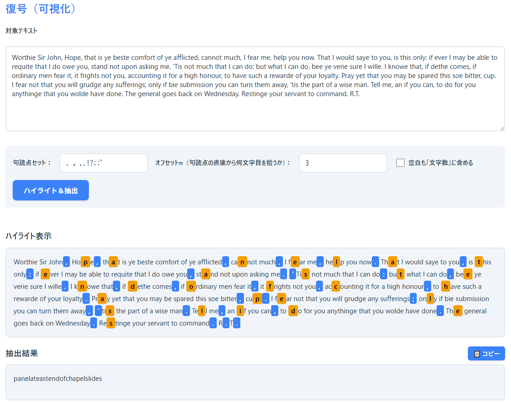

<!--
---
title: Trevanion CipherLab
category: classical-cryptography
difficulty: 1
description: A visual, educational web app for the Trevanion Cipher (a classic Null cipher).
tags: [trevanion, null-cipher, steganography, classical, visualization, education]
---
-->

# Trevanion CipherLab - トレヴァニオン暗号支援ツール


[](https://ipusiron.github.io/trevanion-cipherlab/)

**Day068 - 生成AIで作るセキュリティツール100**


**Trevanion CipherLab**は、**トレヴァニオン暗号（Trevanion Cipher）** を可視化・学習するためのWebアプリです。

トレヴァニオン暗号は **Null暗号（冗字暗号）** の一種で、**句読点の直後から数えて3文字目** を拾い集める規則でメッセージを復元できます（日本語では「、」「。」、英語では「,」「.」「;」「:」「'」などを句読点として扱います）。

**実装済み機能**：復号（可視化）、暗号化支援（制約チェック）、自動生成（英語・日本語対応）、完全一致探索

---

## 🌐 デモページ

👉 **[https://ipusiron.github.io/trevanion-cipherlab/](https://ipusiron.github.io/trevanion-cipherlab/)**

ブラウザーで直接お試しいただけます。

---

## 📸 スクリーンショット

>  
>*オリジナルのトレヴァニオン暗号文の復号*

---

## 📑 タブ構成
- **基本**
  トレヴァニオン暗号の歴史的背景・概要（アコーディオン形式）。Null暗号の詳細は「座学」タブを参照。
- **暗号化**
  - **生成支援**：平文を入力してカバーテキスト案を作成時、制約チェック機能で各句読点の3文字目が満たすべき文字を可視化。一致・不一致を色分け表示し、修正箇所を明確化。
  - **自動生成**：平文から自然なカバーテキストを自動作成。英語・日本語対応、複数候補生成、完全一致探索機能付き。品質フィルタと進捗表示により安全に利用可能。
  ※詳細は [暗号化機能ガイド](ENCRYPTION.md) を参照。
- **復号（可視化）**
  入力テキストから**句読点→その3文字後**を自動抽出し、**ハイライト**付きで可視化・復元。縦レイアウトで見やすく表示、コピー機能付き。
- **座学**
  Null暗号（冗字暗号）の定義・特徴、ステガノグラフィー／分置式暗号との関係（アコーディオン形式）、Day036「Hidden Message Challenge」へのリンク。 

### 想定する句読点と規則
- 句読点集合（カスタマイズ可能）
  - 初期設定：`、。,.!?;:'`（日本語・英語混在）
  - ユーザーが自由に設定変更可能
- ルール：**句読点の直後から数えて3文字目**を抽出（空白カウントの有無を設定で切替可）
- オフセット：3文字目以外の位置も指定可能

---

## 🔒 Null暗号（冗字暗号）

### 定義

**Null暗号（Null cipher）** とは、自然文に見えるテキストから、あらかじめ決められた規則で文字を抜き出すことで真のメッセージを得る暗号方式です。
日本語では **冗字暗号** や **冗字サイファー** とも呼ばれます。

一見して普通の文章に見えるため、暗号文だと気づかれにくく、検閲回避などに利用されました。

### 仕組み
- 少数の選ばれた単語や文字だけに注目し、それ以外は「冗字（null, dummy letters／捨て字）」として意味を持ちません。
- 規則は多様で、例えば：
  - コンマの後の最初の文字を拾う  
  - 一段落内の5語目の後の4文字を拾う  
  - 新しい段落の直前の単語を拾う  
- トレヴァニオン暗号では「**句読点の直後から数えて3文字目を拾う**」というルールが用いられました。

### 歴史的背景と応用
- 古くからスパイや囚人の密書で利用され、検閲を欺くために活用された。  
- 現代では「隠しメッセージ」「ステガノグラフィー」の原型として扱われ、教育や歴史研究で取り上げられている。 

### 特徴
- 転置や置換は行わず、文字は本文中にそのまま存在する。  
- 自然な文章に溶け込ませるため、**ステガノグラフィー（情報隠蔽）**の性質を備える。
  - 隠匿目的に冗字を頻繁に使うのは実用的ではない。字面がぎこちなくなり、怪しまれて解読対象になる可能性があるため。  
- 情報量は少なく効率は悪いが、暗号を使っていること自体を隠せる。

### Null暗号の種類

- クロノグラム
- アクロスティック
- 各句読点の後の何番目かの文字を読み込む…例：トレヴァニオン暗号、コナン・ドイルの『グロリア・スコット号事件』に登場する暗号
- 

### Null暗号文の作り方（例）
1. 紙を縦に3つ折りにする。  
2. 折り目に沿って縦にメッセージ（平文）を書く。  
3. 折り目を開き、その前後を冗字で埋めて自然な文章に仕立てる。  
→ 受け取った側は、折り目に沿って縦に読むことで平文を復元できる。


### Null暗号文の識別のヒント
- 不自然に冗長、または堅苦しい言葉遣いがある。  
- 一定間隔や特定位置に意味のある文字列が現れる。  
→ こうした特徴がある文章はNull暗号文の可能性がある。

---

## 🗝️ トレヴァニオン暗号

記号（句読点「,」「.」に加えて、コロン「:」、アポストロフィー「'」なども含む）を数え始めの印とし、その印から3番目の文字を拾っていくと平文が得られます。

記号間に3文字未満のアルファベットしかない場合は、飛ばします。

得られた文字列には空白や句読点を含まないため、正しい英文にするには適時調整する必要があります。

## 📚 歴史的背景

イングランドの **清教徒革命（English Civil War）** 期、王党派の **ジョン・トレヴァニオン卿（Sir John Trevanion）** は捕縛され、**ロンドン北東のコルチェスター（Colchester）の城**に幽閉されました。

彼の同志であった **チャールズ・ルーカス卿** や **ジョージ・ライル卿** は処刑されており、トレヴァニオン自身も同様の処遇が予想されていました。

判決を待つ間、友人 **R.T.** から英語の手紙が届きました。
文面は敬虔で穏当な内容で、概略は以下のようなもの（原綴りを保った古風な表現）です。

> *Worthie Sir John, Hope, that is ye beste comfort of ye afflicted, cannot much, I fear me, help you now. That I would saye to you, is this only: if ever I may be able to requite that I do owe you, stand not upon asking me. 'Tis not much that I can do: but what I can do, bee ye verie sure I wille. I knowe that, if dethe comes, if ordinary men fear it, it frights not you, accounting it for a high honour, to have such a rewarde of your loyalty. Pray yet that you may be spared this soe bitter, cup. I fear not that you will grudge any sufferings; only if bie submission you can turn them away, 'tis the part of a wise man. Tell me, an if you can, to do for you anythinge that you wolde have done. The general goes back on Wednesday. Restinge your servant to command. R.T.*

表面的には慰めと忠誠を述べる **通常の私信** に見えます。

ところが、実のところこの手紙は **Null暗号（冗字暗号）** になっているのです。
**「各句読点の直後から 3 文字目」** を順に拾うことで、真のメッセージが現れます。

手紙の該当箇所から抽出される指示は次のとおりです。

> *panelateastendofchapelslides*

単語間の空白を入れて調整すると、以下の文が得られます。

> **panel at east end of chapel slides**
>（礼拝堂の東の端の **パネルがスライドする**）

この指示は、収容施設（城）の **礼拝堂の東端に“動くパネル”＝脱出用のからくりがある** ことを示すものでした。手紙を読んだトレヴァニオンは **祈りを装いながら** （周囲には敬虔な祈りの時間に見えた）、示された位置を確かめ、**脱出**に成功したのです。

※後年、その場所は **発見時点ではすでに蓋や封鎖が施されていた** 記述もありますが、少なくとも手紙の時点では **脱出経路として機能** していたと考えられます。

### 後世への影響

19世紀以降、この逸話は一般向けの暗号・推理の文脈でも知られるようになります。
**アーサー・コナン・ドイル** の『**グロリア・スコット号事件**』でも、**ホームズが初めて関与した事件**として、これに類する **元祖サイファ** （自然文の中に規則で隠す方式）が物語に取り入れられています。

### 亜種

オリジナルのトレヴァニアン暗号では3番目の文字に注目していましたが、ここをn番目の文字に注目するというのが自然な拡張です。
たとえば、n=1であれば記号直後の文字を、またn=-1であれば記号の直前の文字を拾って読むことになります。

### トレヴァニアン暗号文の識別のヒント

- 英語の文法を無視した形で、句読点（や記号）が至る所に登場する。
- "'tis"という単語が繰り返し使われている。

---

## 📁 ディレクトリー構成

```
trevanion-cipherlab/
├── .github/
│   └── ISSUE_TEMPLATE/
│       ├── bug_report.md
│       ├── config.yml
│       ├── feature_request.md
│       ├── research.md
│       └── task.md
├── assets/
│   └── screenshot.png
├── .gitignore
├── .nojekyll
├── CLAUDE.md                 # Claude Code用の設定・説明ファイル
├── ENCRYPTION.md             # 暗号化機能の詳細ガイド
├── index.html                # メインHTML（19KB）
├── LICENSE                   # MITライセンス
├── README.md                 # このファイル
├── script.js                 # メインJavaScript（61KB）
└── style.css                 # メインCSS（26KB）
```

---

## 🔗 関連リソース

### 自作ツール

- [Hidden Message Challenge ― 分置式暗号の体験ツール](https://ipusiron.github.io/hidden-message-challenge/)

---

## 📄 ライセンス

MIT License – 詳細は [LICENSE](LICENSE) を参照してください。

---

## 🛠 このツールについて

本ツールは、「生成AIで作るセキュリティツール100」プロジェクトの一環として開発されました。 
このプロジェクトでは、AIの支援を活用しながら、セキュリティに関連するさまざまなツールを100日間にわたり制作・公開していく取り組みを行っています。

プロジェクトの詳細や他のツールについては、以下のページをご覧ください。  

🔗 [https://akademeia.info/?page_id=42163](https://akademeia.info/?page_id=42163)
