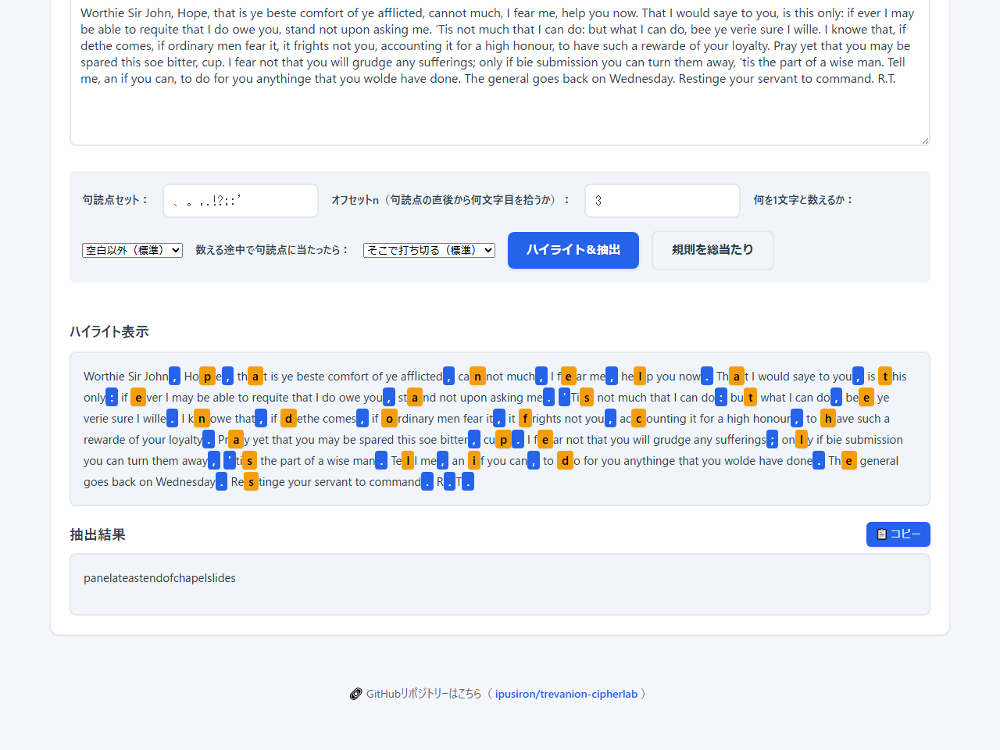
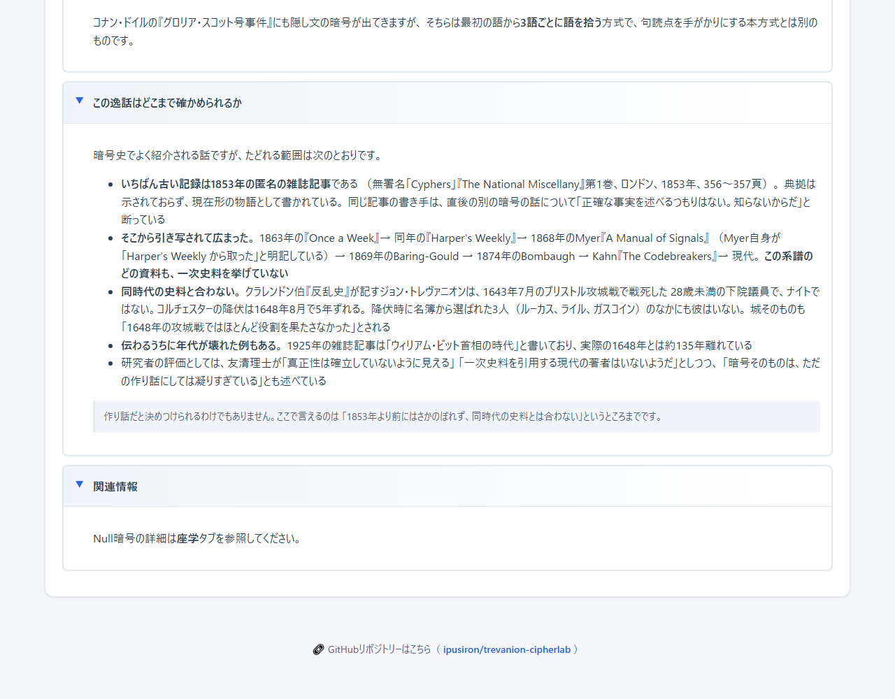
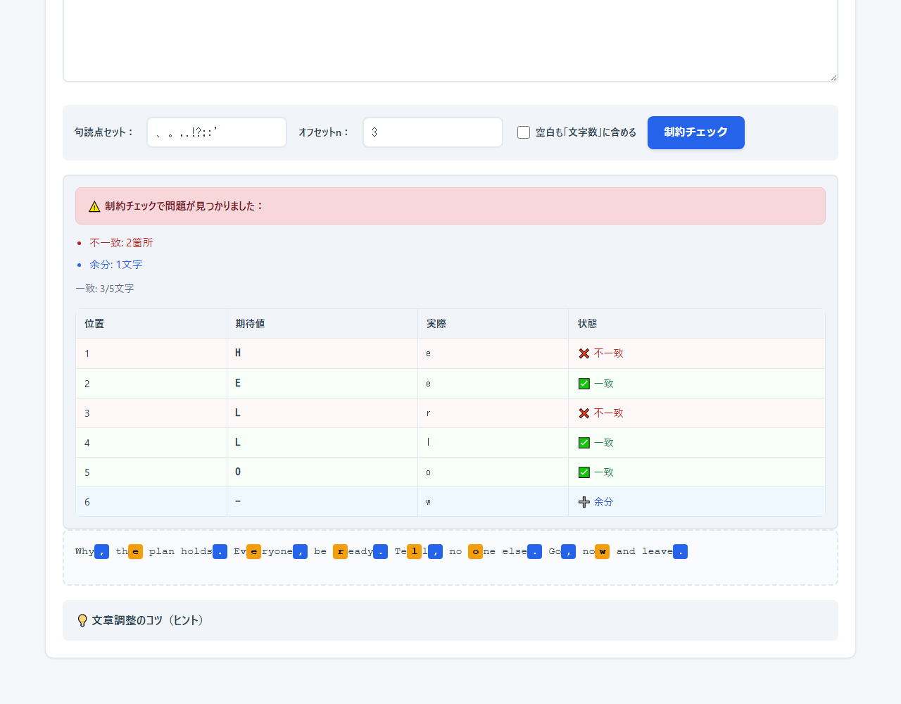
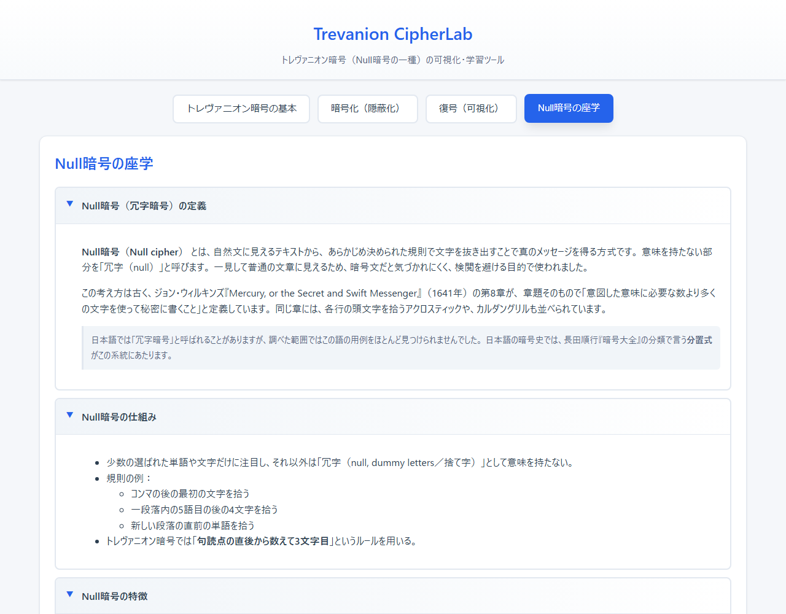
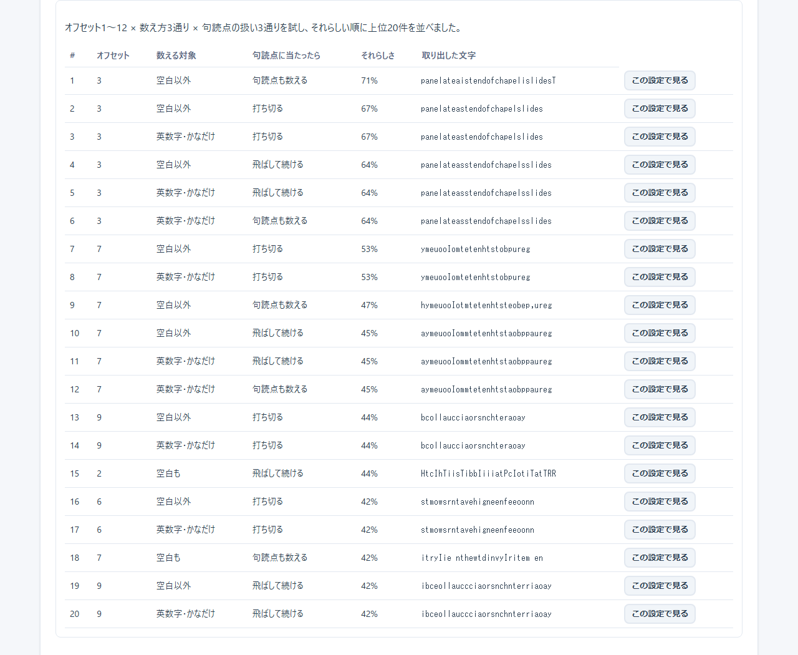

<!--
---
id: day069
slug: trevanion-cipherlab

title: "Trevanion CipherLab"

subtitle_ja: "トレヴァニオン暗号の可視化・学習ツール"
subtitle_en: "Visual learning tool for Trevanion Cipher"

description_ja: "トレヴァニオン暗号（Null暗号の一種）を可視化・学習するためのWebアプリ。復号（可視化）、暗号化支援（制約チェック）、自動生成（英語・日本語対応）、完全一致探索機能を提供。"
description_en: "A visual, educational web app for the Trevanion Cipher (a classic Null cipher). Features decryption visualization, encryption assistance with constraint checking, auto-generation for English/Japanese, and perfect match search."

category_ja:
  - 古典暗号
  - ステガノグラフィー
category_en:
  - Classical Cryptography
  - Steganography

difficulty: 1

tags:
  - trevanion
  - null-cipher
  - steganography
  - classical
  - visualization
  - education

repo_url: "https://github.com/ipusiron/trevanion-cipherlab"
demo_url: "https://ipusiron.github.io/trevanion-cipherlab/"

hub: true
---
-->

[English](README.en.md) · 日本語

# Trevanion CipherLab - トレヴァニオン暗号支援ツール


[](https://ipusiron.github.io/trevanion-cipherlab/)

**Day069 - 生成AIで作るセキュリティツール100**


**Trevanion CipherLab**は、**トレヴァニオン暗号（Trevanion Cipher）** を可視化・学習するためのWebアプリです。

トレヴァニオン暗号は **Null暗号（冗字暗号）** の一種で、**句読点の直後から数えて3文字目** を拾い集める規則でメッセージを復元できます（日本語では「、」「。」、英語では「,」「.」「;」「:」「'」などを句読点として扱います）。

**実装済み機能**：復号（可視化）、暗号化支援（制約チェック）

**実験的な機能**：自動生成、完全一致探索。いまの作り方では、句読点の直後に置かれるのが接続詞のほうになるため、狙った文字が抽出位置にそろうのは偶然に頼っています。カバーテキストは「生成支援」で自分で書き、制約チェックで確かめるほうが確実です。

---

## 🌐 デモページ

👉 **[https://ipusiron.github.io/trevanion-cipherlab/](https://ipusiron.github.io/trevanion-cipherlab/)**

ブラウザーで直接お試しいただけます。

---

## 📸 スクリーンショット

>
>*復号タブ。逸話の手紙から隠された文を取り出したところ（青＝句読点、黄＝抽出される文字）*

>
>*基本タブ。逸話の出どころと、同時代の史料との食い違いを出典つきで示す*

>
>*暗号化タブ（生成支援）。自分で書いたカバーテキストを1文字ずつ突き合わせる*

>
>*座学タブ。Null暗号の定義と、確かめられた使用例を出典つきで解説する*

>
>*復号タブ。規則を総当たりし、英語・日本語らしさでスコアを付けて並べる*

---

## 📑 タブ構成
- **基本**
  トレヴァニオン暗号の歴史的背景・概要（アコーディオン形式）。Null暗号の詳細は「座学」タブを参照。
- **暗号化**
  - **生成支援**：平文を入力してカバーテキスト案を作成時、制約チェック機能で各句読点の3文字目が満たすべき文字を可視化。一致・不一致を色分け表示し、修正箇所を明確化。
  - **自動生成**：平文から自然なカバーテキストを自動作成。英語・日本語対応、複数候補生成、完全一致探索機能付き。品質フィルタと進捗表示により安全に利用可能。
  ※詳細は [暗号化機能ガイド](ENCRYPTION.md) を参照。
- **復号（可視化）**
  入力テキストから**句読点→その3文字後**を自動抽出し、**ハイライト**付きで可視化・復元。縦レイアウトで見やすく表示、コピー機能付き。
  - **数え方を選べる**：何を1文字と数えるか（空白以外／空白も／英数字・かなだけ）、数える途中で句読点に当たったときの扱い（打ち切る／飛ばして続ける／句読点も数える）
  - **規則の総当たり**：オフセット1〜12 × 数え方3通り × 句読点の扱い3通りを試し、**英語・日本語らしさのスコア順**に並べる。行ごとの「この設定で見る」で、その規則の結果をそのまま画面に反映できる
  - **分かち書き**：取り出した文字列には空白が入らないので、小さな英単語の辞書で区切り直す（`panelateastendofchapelslides` → `panel at east end of chapel slides`）。辞書にない語が混じると区切れないため、そのときは出さない
  - **ほかのツールへ渡す**：取り出した文を [Frequency Analyzer](https://ipusiron.github.io/frequency-analyzer/)（Day009）で開けるリンクを出す。URLのハッシュに載せるので、サーバーへは送られない
- **座学**
  Null暗号（冗字暗号）の定義・特徴、ステガノグラフィー／分置式暗号との関係（アコーディオン形式）、Day036「Hidden Message Challenge」へのリンク。 

### 想定する句読点と規則
- 句読点集合（カスタマイズ可能）
  - 初期設定：`、。,.!?;:'`（日本語・英語混在）
  - ユーザーが自由に設定変更可能
- ルール：**句読点の直後から数えて3文字目**を抽出
- オフセット：3文字目以外の位置も指定可能（1〜12）
- 数える対象：空白以外（標準）／空白も数える／英数字・かなだけ数える
- 数える途中で句読点に当たったとき：そこで打ち切る（標準）／飛ばして数え続ける／句読点も1文字と数える

---

## 🔒 Null暗号（冗字暗号）

### 定義

**Null暗号（Null cipher）** とは、自然文に見えるテキストから、あらかじめ決められた規則で文字を抜き出すことで真のメッセージを得る暗号方式です。
日本語では **冗字暗号** と呼ばれることがありますが、調べた範囲ではこの語の用例をほとんど見つけられませんでした。日本語の暗号史では、長田順行『暗号大全』の分類で言う **分置式** がこの系統にあたります。

一見して普通の文章に見えるため、暗号文だと気づかれにくく、検閲回避などに利用されました。

### 仕組み
- 少数の選ばれた単語や文字だけに注目し、それ以外は「冗字（null, dummy letters／捨て字）」として意味を持ちません。
- 規則は多様で、例えば：
  - コンマの後の最初の文字を拾う  
  - 一段落内の5語目の後の4文字を拾う  
  - 新しい段落の直前の単語を拾う  
- トレヴァニオン暗号では「**句読点の直後から数えて3文字目を拾う**」というルールが用いられました。

### 歴史的背景と応用
- 古くからスパイや囚人の密書で利用され、検閲を欺くために活用された。  
- 現代では「隠しメッセージ」「ステガノグラフィー」の原型として扱われ、教育や歴史研究で取り上げられている。 

### 特徴
- 転置や置換は行わず、文字は本文中にそのまま存在する。  
- 自然な文章に溶け込ませるため、**ステガノグラフィー（情報隠蔽）**の性質を備える。
  - 隠匿目的に冗字を頻繁に使うのは実用的ではない。字面がぎこちなくなり、怪しまれて解読対象になる可能性があるため。  
- 情報量は少なく効率は悪いが、暗号を使っていること自体を隠せる。

### Null暗号の種類

- クロノグラム
- アクロスティック
- 各句読点の後の何番目かの文字を読み込む…例：トレヴァニオン暗号、コナン・ドイルの『グロリア・スコット号事件』に登場する暗号

### Null暗号文の作り方（例）
1. 紙を縦に3つ折りにする。  
2. 折り目に沿って縦にメッセージ（平文）を書く。  
3. 折り目を開き、その前後を冗字で埋めて自然な文章に仕立てる。  
→ 受け取った側は、折り目に沿って縦に読むことで平文を復元できる。


### Null暗号文の識別のヒント
- 不自然に冗長、または堅苦しい言葉遣いがある。  
- 一定間隔や特定位置に意味のある文字列が現れる。  
→ こうした特徴がある文章はNull暗号文の可能性がある。

---

## 🗝️ トレヴァニオン暗号

記号（句読点「,」「.」に加えて、コロン「:」、アポストロフィー「'」なども含む）を数え始めの印とし、その印から3番目の文字を拾っていくと平文が得られます。

記号間に3文字未満のアルファベットしかない場合は、飛ばします。

得られた文字列には空白や句読点を含まないため、正しい英文にするには適宜調整する必要があります。

## 📚 歴史的背景

この暗号には、次の逸話が伝えられています。**ただし、この話は一次史料にたどり着けません**（後述の「この逸話はどこまで確かめられるか」を参照）。

イングランドの **清教徒革命（English Civil War）** 期、王党派の **ジョン・トレヴァニオン（John Trevanion）** が捕縛され、**ロンドン北東のコルチェスター（Colchester）の城**に幽閉された。判決を待つ間、**R.T.** と署名された英語の手紙が届く。文面は敬虔で穏当な内容で、次のようなものです。

> *Worthie Sir John, Hope, that is ye beste comfort of ye afflicted, cannot much, I fear me, help you now. That I would saye to you, is this only: if ever I may be able to requite that I do owe you, stand not upon asking me. 'Tis not much that I can do: but what I can do, bee ye verie sure I wille. I knowe that, if dethe comes, if ordinary men fear it, it frights not you, accounting it for a high honour, to have such a rewarde of your loyalty. Pray yet that you may be spared this soe bitter, cup. I fear not that you will grudge any sufferings; only if bie submission you can turn them away, 'tis the part of a wise man. Tell me, an if you can, to do for you anythinge that you wolde have done. The general goes back on Wednesday. Restinge your servant to command. R.T.*

表面的には慰めと忠誠を述べる **通常の私信** に見えます。

ところが、実のところこの手紙は **Null暗号（冗字暗号）** になっているのです。
**「各句読点の直後から 3 文字目」** を順に拾うことで、真のメッセージが現れます。

手紙の該当箇所から抽出される指示は次のとおりです。

> *panelateastendofchapelslides*

単語間の空白を入れて調整すると、以下の文が得られます。

> **panel at east end of chapel slides**
>（礼拝堂の東の端の **パネルがスライドする**）

この指示は、収容施設（城）の **礼拝堂の東端に動く板がある** ことを示すものでした。トレヴァニオンは祈りを装って礼拝堂に入り、そこから逃れた——というのが、伝えられている話の結びです。

ただし、**脱出の場面は、いちばん古い記録（1853年）には書かれていません**。その記事は「どうやって脱出したかは他の人に語ってもらう」として、自分では語っていません。脱出の描写が現れるのは1863年以降の系譜からです。

### この逸話はどこまで確かめられるか

- **いちばん古い記録は1853年の匿名の雑誌記事**である（無署名「Cyphers」『The National Miscellany』第1巻、ロンドン、1853年、356〜357頁）。典拠は示されておらず、現在形の物語として書かれている。同じ記事の書き手は、直後の別の暗号の話について「正確な事実を述べるつもりはない。知らないからだ」と断っている
- **そこから引き写されて広まった。**1863年の『Once a Week』→ 同年の『Harper's Weekly』→ 1868年のMyer『A Manual of Signals』（Myer自身が「Harper's Weekly から取った」と明記している）→ 1869年のBaring-Gould → 1874年のBombaugh → Kahn『The Codebreakers』→ 現代。**この系譜のどの資料も、一次史料を挙げていない**
- **同時代の史料と合わない。**クラレンドン伯『反乱史』が記すジョン・トレヴァニオンは、1643年7月のブリストル攻城戦で戦死した28歳未満の下院議員で、ナイトではない（クラレンドンは隣に並ぶスラニングには `sir` を付けるが、トレヴァニオンには付けない）。コルチェスターの降伏は1648年8月で5年ずれる。降伏時に名簿から選ばれた3人（ルーカス、ライル、ガスコイン）のなかにも彼はいない。城そのものも「1648年の攻城戦ではほとんど役割を果たさなかった」とされ、礼拝堂は天守2階、1922年に見つかった階段はその3層下である
- **伝わるうちに年代が壊れた例もある。**1925年の雑誌記事は「ウィリアム・ピット首相の時代」と書いており、実際の1648年とは約135年離れている
- 英語圏で最初の単行本規模の暗号史であるHulme『Cryptography』（1898年）は、`nulles or non-significants` の語を使いながら、**トレヴァニオンにもコルチェスターにも一度も触れていない**
- 研究者の評価としては、友清理士が「真正性は確立していないように見える」「一次史料を引用する現代の著者はいないようだ」としつつ、「暗号そのものは、ただの作り話にしては凝りすぎている」とも述べている

作り話だと決めつけられるわけでもありません。ここで言えるのは「1853年より前にはさかのぼれず、同時代の史料とは合わない」というところまでです。

### 手紙の文面について

よく引用される文面には、少なくとも次の2つの系統があります。**どちらを使うかで、正しい設定が変わります。**

| 版 | 特徴 | 本ツールでの設定 |
|---|---|---|
| アポストロフィーつき（`'Tis`） | 小文字混じり。本ツールが例に使っている形 | 句読点に `'` を含め、空白を数えず、**次の句読点で打ち切る** |
| 大文字・アポストロフィーなし | `TIS` と綴る | 上記のどの数え方でも同じ結果になる |

本ツールが初期値に入れている文面は、1853年・1863年・1890年のどの資料とも完全には一致しない折衷形です。

### 後世への影響

19世紀以降、この逸話は一般向けの暗号・推理の文脈でも知られるようになります。
**アーサー・コナン・ドイル** の『**グロリア・スコット号事件**』でも、**ホームズが初めて関与した事件**として、自然文のなかに規則で隠す方式が物語に取り入れられています。ただしそちらは **最初の語から3語ごとに語を拾う** 方式で、句読点を手がかりにする本方式とは別のものです（この作品を通じて本方式が広まった、とまでは言えません）。

### 亜種

オリジナルのトレヴァニオン暗号では3番目の文字に注目していましたが、ここをn番目の文字に注目するというのが自然な拡張です。
たとえば、n=1であれば記号直後の文字を、またn=-1であれば記号の直前の文字を拾って読むことになります。

### トレヴァニオン暗号文の識別のヒント

- 英語の文法を無視した形で、句読点（や記号）が至る所に登場する。
- "'tis"という単語が繰り返し使われている。

---

## 🎯 ユースケース

### このツールならではの使い方

- 規則を知る人だけに隠し文が現れることを確かめる（ステガノグラフィーの授業）：トレヴァニオンの手紙を貼り、各句読点の直後から3文字目を拾うと、panelateastendofchapelslidesが現れる。空白を入れると「panel at east end of chapel slides（礼拝堂の東の端のパネルがスライドする）」と読める。規則を知らなければ敬虔な私信にしか見えず、暗号文のように怪しまれない。隠し場所を知る人だけが読めるステガノグラフィーを、逸話の原文で確かめられる
- オフセットの信号とノイズを見分ける（解析・探索の授業）：同じ手紙で拾う文字の位置を2・3・4文字目と変え、英語らしさのスコアを比べると、0.3778・0.6741・0.2923になり、正しい3文字目だけがはっきり高い。ほかのオフセットはただの文字の並びで、スコアが低い。たくさんの候補から意味のある1つを、スコアで選び出す探索の考え方を確かめられる
- 数え方を変えると拾う文字が変わることを確かめる（計測・データ処理の授業）：同じ手紙・同じ3文字目でも、「空白も数える」に切り替えると、拾う文字がずれてoha ehsftsue fftcoru nsenoheになり、意味のある文は出ない。何を1文字と数えるかという規則の違いだけで、同じ入力から別の結果が出ることを示せる

### セキュリティの学習

- Null暗号（冗字暗号）の仕組みを、逸話の手紙そのもので確かめる
- 規則を知らなければただの文章に見えることを通して、暗号とステガノグラフィーの違いを体感する
- CTFや謎解きで「数字でない隠し文」に当たったとき、句読点やオフセットを変えて試す

### 教育・自習

- 国語や英語の授業で、文章に規則を仕込む課題にする。作る側に回ると、自然な文に見せる難しさがわかる
- 歴史の授業で、**この逸話の検証そのもの**を史料批判の教材にする。1853年より前にさかのぼれないこと、同時代の史料と合わないことを、資料をたどって確かめられる
- 情報の授業で、情報を隠す方法の分類（暗号・ステガノグラフィー）を具体例で扱う

### 仕事・実務

- 情報漏えいや検閲の研修で、自然文に情報を混ぜる手口を見せる
- 自分で書いた抽出処理の出力を、このツールと突き合わせて確かめる
- ほかのツールと結果が合わないとき、数え方（次の句読点で打ち切るか）や空白の扱いの違いが原因かを切り分ける

### 趣味・創作

- 脱出ゲームや謎解きの問題を作り、答えを検算する
- 小説やゲームに出す暗号の設定を、実際に動く形で確かめる
- 手紙やカードに短いメッセージを仕込む

### ほかのツールとの組み合わせ

- [Hidden Message Challenge](https://ipusiron.github.io/hidden-message-challenge/)（Day036）：分置式暗号の体験。位置抽出のチャレンジがNull暗号にあたる

### 限界

- 学習用のツールです。**秘密を守る目的には使えません。**規則を知られれば読めますし、規則に合わせて書くと文が不自然になりやすく、かえって目を引きます
- 自動生成は**実験的**です。確実に作るなら「生成支援」で自分で書き、制約チェックにかけてください
- 逸話そのものの史実性は確かめられていません（「この逸話はどこまで確かめられるか」を参照）

---

## 🧪 テスト

```bash
npm test
```

- Node.js 22以降で動きます。依存パッケージはありません（`node --test` だけを使います）
- GitHub Actionsで、pushとpull requestのたびに自動で実行します
- 逸話の手紙の2つの版で、どの設定なら隠された文が出るかを固定しています。3つの数え方の違い、制約チェック、境界（空・句読点だけ・サロゲートペア）、配色のコントラスト比、index.htmlの静的な検査を含みます

---

## 📁 ディレクトリー構造

```
trevanion-cipherlab/
├── index.html              # 画面（4つのタブ・アコーディオン）
├── script.js               # 画面側の処理（入力の読み取り・表示・タブ・生成）
├── style.css               # 配色とレイアウト（狭い画面への対応を含む）
├── js/                     # スクリプト
│   ├── messages.js         # 画面の文言（日本語・英語で同じキーを持つ辞書）
│   ├── i18n.js             # 言語の選択と、data-i18n を書いた要素の差し替え
│   ├── trevanion-core.js   # 計算部（抽出・制約チェック・総当たり・分かち書き。DOMを使わない）
│   └── trevanion-words.js  # 分かち書きに使う英単語の小さな辞書
├── test/                   # テスト（node --test で実行する）
│   ├── load.js             # 画面と同じスクリプトの読み込みと、照合用の参照実装
│   ├── core.test.js        # 計算部（逸話の手紙・3つの数え方・制約チェック・境界）
│   ├── html.test.js        # index.html の静的な検査（CSP・id・aria・外部参照）
│   ├── i18n.test.js        # 日英の辞書と画面の文言の対応
│   ├── contrast.test.js    # 配色のコントラスト比と、狭い画面での折り返し
│   ├── readme.test.js      # README と ENCRYPTION.md の記述を実装と突き合わせる
│   └── format.test.js      # 1行に詰め込んでいないか、計算部がDOMを使っていないか
├── .github/                # GitHub の設定
│   ├── workflows/          # GitHub Actions のワークフロー
│   │   └── test.yml        # push と pull request で npm test を走らせる
│   └── ISSUE_TEMPLATE/     # Issue のテンプレート
│       ├── bug_report.md   # 不具合の報告
│       ├── config.yml      # テンプレートの選択画面の設定
│       ├── feature_request.md # 機能の提案
│       ├── research.md     # 調べもののメモ
│       └── task.md         # 作業の記録
├── assets/                 # 画像
│   ├── screenshot.png      # スクリーンショット（復号タブ）
│   ├── screenshot2.png     # スクリーンショット（基本タブ・逸話の検証）
│   ├── screenshot3.png     # スクリーンショット（暗号化タブ・制約チェック）
│   ├── screenshot4.png     # スクリーンショット（座学タブ）
│   ├── screenshot5.png     # スクリーンショット（規則の総当たり）
│   └── en/                 # 英語の画面のスクリーンショット
│       ├── screenshot.png  # スクリーンショット（復号タブ）
│       ├── screenshot2.png # スクリーンショット（基本タブ）
│       ├── screenshot3.png # スクリーンショット（暗号化タブ）
│       ├── screenshot4.png # スクリーンショット（座学タブ）
│       └── screenshot5.png # スクリーンショット（規則の総当たり）
├── package.json            # テストの実行設定（依存パッケージはない）
├── CLAUDE.md               # Claude Code 向けの案内
├── ENCRYPTION.md           # 暗号化の機能のくわしい説明
├── LICENSE                 # MITライセンス
├── .gitignore              # Git の除外設定
├── .nojekyll               # GitHub Pages で Jekyll を使わない指定
├── README.md               # このファイル
└── README.en.md            # 英語版のREADME
```

---

## 💻 動作環境

- モダンブラウザー（Chrome・Edge・Firefox・Safari の最新版）
- ローカルで開く場合は `index.html` をそのままブラウザーで開けます（読み込むファイルはすべて同じフォルダーの中にあります）
- テストを走らせる場合は Node.js 22以降が要ります

---

## 🔗 関連リソース

### 自作ツール

- [Hidden Message Challenge ― 分置式暗号の体験ツール](https://ipusiron.github.io/hidden-message-challenge/)（Day036）
- [Frequency Analyzer](https://ipusiron.github.io/frequency-analyzer/)（Day009）— 取り出した文の文字の出現頻度を調べる。復号タブのリンクからそのまま渡せる

### ほかのツールとの違い

本ツールは、句読点から数える途中で次の句読点に出会ったら、**その句読点からは拾わない**という数え方を既定にしています。
数えつづける流儀のツールもあり、同じ文でも結果が変わります。

| 入力 | 打ち切る（本ツール） | 打ち切らない |
|---|---|---|
| `ab, cd. ef, ghijk`（3文字目・空白を数えない） | `i` | `egi` |

アポストロフィーつきの手紙の版では、**打ち切る数え方でないと正しい文が出ません**。設定で切り替えて、違いをその場で確かめられます。

規則がわからない暗号文に当たったときは、「規則を総当たり」を押してください。**それらしい順に並ぶ**ので、上から見ていけば当たりが見つかります。

---

## 📄 ライセンス

MIT License – 詳細は [LICENSE](LICENSE) を参照してください。

---

## 🛠️ このツールについて

本ツールは、「生成AIで作るセキュリティツール100」プロジェクトの一環として開発されました。 
このプロジェクトでは、AIの支援を活用しながら、セキュリティに関連するさまざまなツールを100日間にわたり制作・公開していく取り組みを行っています。

プロジェクトの詳細や他のツールについては、以下のページをご覧ください。  

🔗 [https://akademeia.info/?page_id=42163](https://akademeia.info/?page_id=42163)
